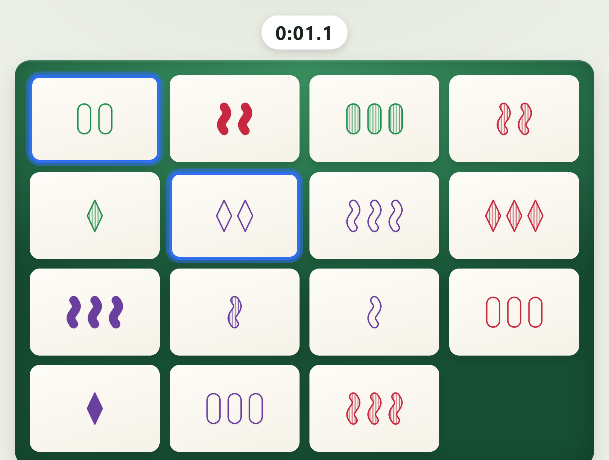
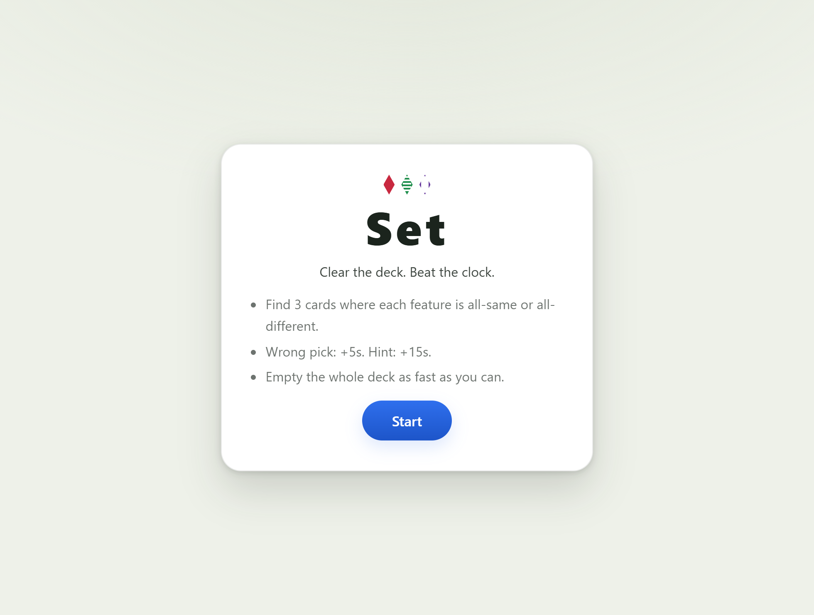
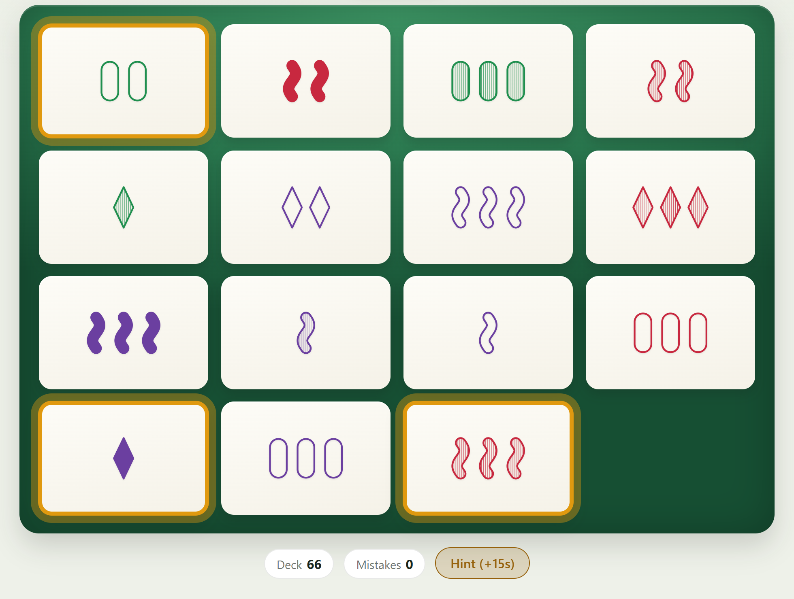

# Set — Speed Solitaire

A single-player, timed version of the classic card game **Set**: clear the whole
81-card deck as fast as you can. Built with React + Vite + TypeScript, deployed as
a static site.

**▶ Play it live: <https://set-game-qn3r.onrender.com/>**

## Screenshots

| Start screen | Hint — highlights a valid Set |
| :---: | :---: |
|  |  |

## How to play

Find three cards where each of the four features — **number, shape, shading, color** —
is either all the same or all different across the three. Clear the entire deck to win,
and race the clock: wrong picks add 5 seconds, hints add 15. Your best time is saved
locally in your browser.

## Develop

    npm install
    npm run dev        # local dev server
    npm test           # run the test suite
    npm run typecheck  # TypeScript checks
    npm run build      # production build to dist/

## Deploy (Render)

This repo includes a `render.yaml` Static Site blueprint (build `npm install &&
npm run build`, publish `dist`, SPA rewrite). In the Render dashboard, create a
new Static Site from this GitHub repo, or use the blueprint directly. Every push to
`main` runs CI (typecheck + test + build) and triggers an automatic redeploy.
